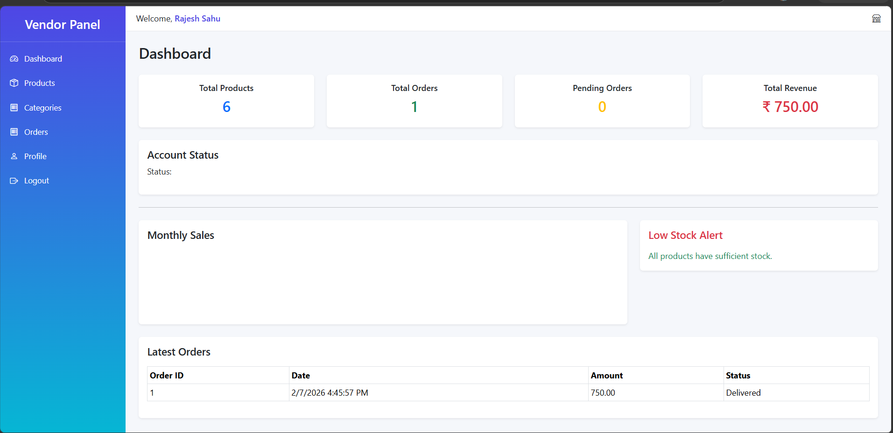
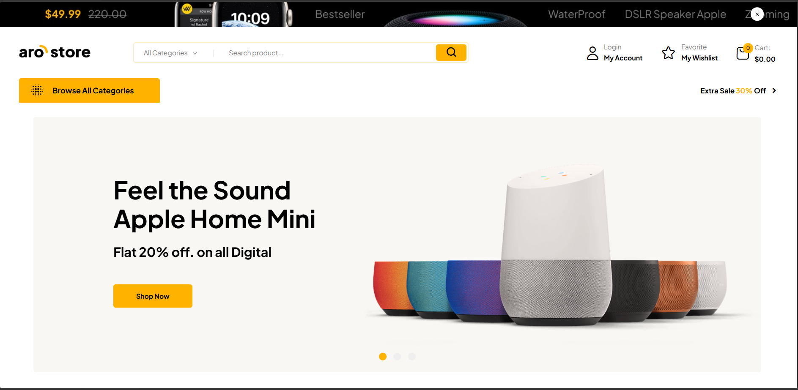
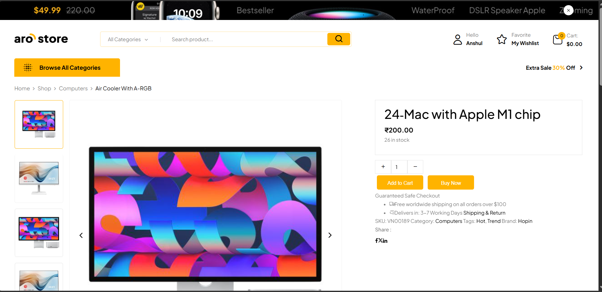
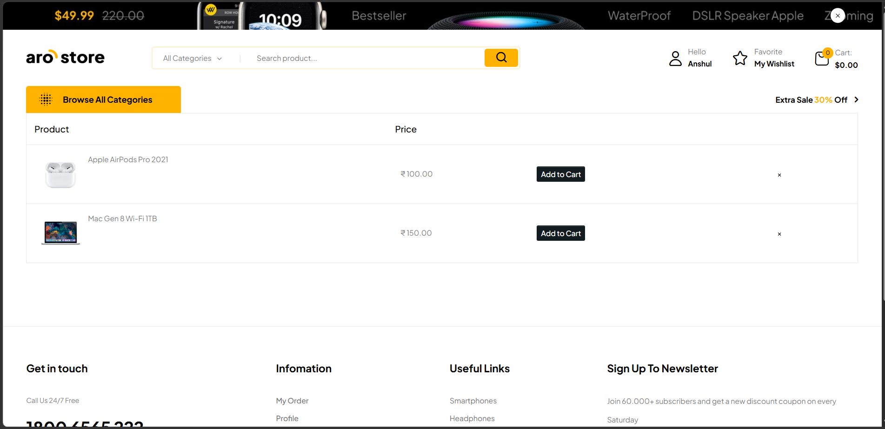

# ⚡ Electronic Marketplace - Multi Vendor E-Commerce Platform

## 📌 Overview

Electronic Marketplace is a full-featured Multi-Vendor E-Commerce Web Application built using ASP.NET Web Forms, C# (.NET Framework), SQL Server, HTML, CSS, Bootstrap, and JavaScript.

The platform allows multiple vendors to register, manage products, receive orders, and track sales while customers can browse products, add items to wishlist/cart, place orders, and track their purchases.

The system includes separate Admin, Vendor, and Client panels with role-based access control and a complete order management workflow.

---

## 🚀 Key Features

### 👤 Client Features

- User Registration & Login
- Email OTP Verification
- Forgot Password
- Product Browsing
- Category & Subcategory Filtering
- Product Details Page
- Session-Based Shopping Cart
- Live Wishlist System
- Checkout Process
- Cash On Delivery (COD)
- Order Placement
- Order Tracking
- My Orders Page
- Profile Management
- Responsive Design

---

### 🏪 Vendor Features

- Vendor Registration
- Vendor Approval Workflow
- Product Management
  - Add Product
  - Edit Product
  - Delete Product
  - Upload Multiple Images
- Category Management
- Subcategory Management
- Order Management
- Order Status Updates
- Inventory Management
- Vendor Dashboard

---

### 🛠️ Admin Features

- Admin Authentication
- Vendor Approval/Rejection
- User Management
- Category Management
- Product Monitoring
- Order Monitoring
- Vendor Control Panel
- Platform Statistics
- Role-Based Access Control

---

## 📦 Core Modules

### Authentication Module

- Registration
- Login
- OTP Verification
- Password Recovery
- Session Management

### Product Module

- Product Catalog
- Product Details
- Product Images
- Product Search
- Product Filtering

### Cart Module

- Add To Cart
- Update Quantity
- Remove Item
- Cart Summary
- Session-Based Cart Storage

### Wishlist Module

- Live Wishlist Toggle
- Real-Time Wishlist Count
- User-Based Wishlist Storage

### Order Module

- Checkout
- Order Placement
- Order Items
- Delivery Address Management
- Order Tracking
- Order History

---

## 🏗️ Technology Stack

### Frontend

- HTML5
- CSS3
- Bootstrap
- JavaScript
- jQuery

### Backend

- ASP.NET Web Forms
- C#

### Database

- Microsoft SQL Server

### Development Environment

- Visual Studio 2012 Compatible

---

## 🗄️ Database Tables

### Users
Stores Admins, Vendors, and Clients.

### Categories
Stores product categories.

### SubCategories
Stores product subcategories.

### Products
Stores product details.

### ProductImages
Stores multiple product images.

### Wishlist
Stores customer wishlist products.

### Orders
Stores order information.

### OrderItems
Stores ordered products.

### OrderAddress
Stores shipping and delivery address.

### VendorDetails
Stores vendor business information.

---

## 🔐 Security Features

- Role-Based Authentication
- Session Validation
- Email OTP Verification
- OTP Expiry Management
- Vendor Approval Workflow
- Input Validation
- Duplicate Record Prevention
- Secure Access Control

---

## 📊 Order Workflow

```text
Customer Registration
        ↓
Browse Products
        ↓
Add To Cart
        ↓
Checkout
        ↓
Place Order
        ↓
Order Created
        ↓
Vendor Receives Order
        ↓
Vendor Updates Status
        ↓
Customer Tracks Order
        ↓
Delivered
```

---

## 🎯 Advanced Features Implemented

- Multi-Vendor Marketplace Architecture
- Multiple Product Image Upload
- Wishlist Management System
- Live Cart Count
- Live Wishlist Count
- OTP Verification System
- Vendor Approval System
- Order Tracking
- Session-Based Authentication
- Responsive User Interface
- Product Search & Filtering
- Role-Based Panels

---

## 📈 Future Enhancements

- Razorpay Payment Gateway Integration
- Online Payments
- Product Reviews & Ratings
- Coupons & Discounts
- Invoice Generation
- Email Notifications
- Push Notifications
- Analytics Dashboard
- REST API Development
- Mobile Application

---

## 🧠 Learning Outcomes

- Learned Multi-Vendor E-Commerce Architecture
- Implemented Role-Based Authentication
- Designed Relational Database Structures
- Developed Order Processing Workflow
- Built Wishlist and Cart Functionality
- Improved SQL Query Optimization Skills
- Enhanced ASP.NET Web Forms Development Skills

---

## 👨‍💻 Developer

**Rajesh Sahu**

### Skills

- ASP.NET Web Forms
- C#
- SQL Server
- HTML
- CSS
- JavaScript
- Bootstrap

---

## ⭐ Project Status

| Property | Value |
|-----------|--------|
| Version | 1.0 |
| Status | Completed |
| Type | Multi-Vendor E-Commerce Platform |

---

## 📸 Screenshots

### Vendor Dashboard


### Homepage


### Product Detail Page


### Wishlist Page


---

## 📄 License

This project is developed for educational, portfolio, and demonstration purposes.

---

### ⭐ If you found this project useful, consider giving it a star on GitHub.
